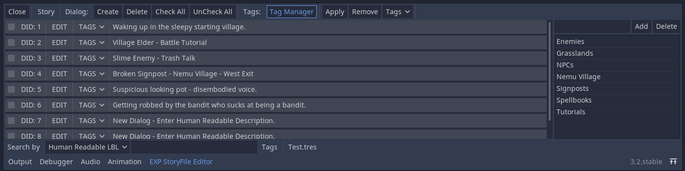
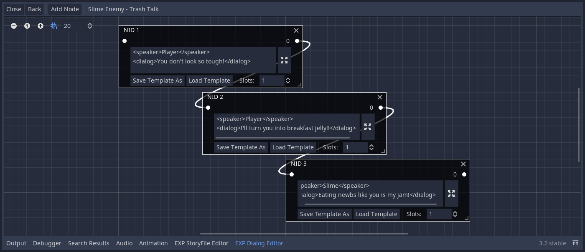

## EXP Godot Dialog System v.1.2.0
#### By David Lipps aka Dave the Dev at EXPWorlds for Godot 3.2 Stable
---

---

This is an addon which assists in the generation, organization, storage, and access of large amounts of text data for Godot Engine projects. It consists of a Story Editor to create and manage lists of dialog records via tags and search filters. And a Dialog Editor through which text/dialog data is created and edited via graph nodes. Although primary designed to handle game dialog, the editors can be used to manage text data for any purpose. Text data can be saved to resource files and read in your game code via the provided helper class.

---
#### Documentation:
- Click [here](https://docs.godotengine.org/en/stable/tutorials/plugins/editor/index.html) to learn how to use Godot plugins.
- Once the plugin is active in the project settings, the StoryFile Editor can be found in the Project -> Tools menu as the "EXP StoryFile Editor". When selected from the tools menu, the StoryFile Editor will become available in bottom panel along with the Output, Debugger, and Animation tools.
- Each project file is called a Story. Each Story contains many Dialogs (DID: Dialog ID) and each dialog record contains numerous Nodes (NID: Node ID). Each node stores text and potentially numerous "slots" that may connect to other nodes. When a slot is connected to another node, it associates itself with the NID of the node its connected to.
- The Dialog System is comprised of two editors. The StoryFile Editor and Dialog Editor. The StoryFile Editor manages all the dialog records in the story, while the Dialog Editor manages the nodes contained in each dialog record.
- The EXP Dialog System is back-end only, it will help you create, manage, store and access text, but parsing the text and putting it to the screen is the responsiblity of each individual project. Once a baked story file is created, the provided StoryFile Reader helper class will allow your project access to data you've created and saved with the Editors.
##### The StoryFile Editor
- In the StoryFile Editor, dialog records can be created and deleted. Each new dialog record will be assigned a unique DID. To delete a record, check all the records you wish to delete, and press Delete.
- Human readable descriptions can be given to each dialog record to describe its contents, which can be searched using the filter tools.
- Under the "Story" menu, using Save As, saves all the text and node connection data to a Story File Resource, plus information needed to load the data back into the editors for further editing. However, using Bake As saves only non-extraneous text and node connection data to a Story File Resource. Baked Story Files cannot be reloaded into the editor.
- Tags can be added and removed from the story project via the Tag Manager.
- To apply a tag to a dialog record, select the desired tag from the Tag drop-down menu in the tag section, check all dialog records you wish to apply the tag to, and press apply. And do similarly to remove tags from dialog records.
- Dialog Records can be given a name which is associated with the DID. To give the record a name, click the "NAME" field and rename it. To rename it again, simply click on the name. Just as DIDs are unique to each record, names must be unique too. The editor will not let you use a name that is already in use by other record.
- Typing a query in the "Search By" text box will filter and display only the dialog records whose human readable descriptions match the entered query.
- The Search By menu can be changed between searching the human readable descriptions, by DIDs, and by record names.
- In the Search By Tag menu, tags can be toggled on and off, to show and hide dialog records associated with tags, or records with no tags. The tag menu works in conjunction with the search query, so be mindful of the settings when searching for records.
- To edit the nodes in a dialog record, click the "EDIT" button on the desired record and the Dialog Editor will be opened.
##### The Dialog Editor
- Click the "Add Node" button to add new nodes. Each new node will be assigned a unique NID.
- Text can be entered into each node. Clicking the expand button will open a larger text editor window.
- You can also save and load text templates to and from nodes in the Dialog Editor to make the process of entering text less painful and error prone.
- Each node has one input slot which any number of nodes may connect to and any number of output slots. Use the Slot spinbox to pick the desired number of output slots.
- For variable injection, custom bbcode style tags can be used. When your project reads a story file, it can parse and replace the text before displaying to the screen.
- For branching logic, slot connections are stored for each node. Simple logic can be represented via your project's custom script to choose which output slot to follow at run time.
- Keep in mind that, while the node connections are stored in the Story File, technically, using node connections is not at all required. Your project can access any DID/NID, at any time, via the StoryFile Reader. However, the node connections can also be read via the StoryFile Reader and used in your project, if required by your use case.
##### Localization and Text Translation
- The data in a Story Project can be exported to a CSV formatted file. A CSV record will be generated for each node in every dialog record. The text associated with each DID/NID may then be edited/translated in any software capable of using CSV files. Once the edits are complete, the CSV file can be reloaded into the Story Project and the text in each node will be replaced.
- However, keep in mind importing CSV files will not create new dialog records or nodes. For the text to be replaced, the dialog record and nodes must already exist. Be sure the correct story file is loaded in the editor before loading its corresponding CSV file.
- When the edited text is loaded from CSV file, the Story Project can be saved as a unique file for each localization/language required. (ex. Story_en.tres or Story_jp.tres) Your project can choose which story file to load and use in the StoryFile Reader based on local settings.

#### Using the Story File Reader Helper Class:
Once you've written all your text, and baked a story file, you can use the Story Reader Helper Class to access the text and node connection data from the file in your projects. Here is an example of how to use the story reader and the class documentation...

	var Story_Reader_Class = load("res://addons/EXP-System-Dialog/Reference_StoryReader/EXP_StoryReader.gd")
	var Story_Reader = Story_Reader_Class.new()
	
	var story = load("baked-story.tres")
	Story_Reader.read(story)
	
	var did : int = 1
	var nid : int = 1
	var text : String = Story_Reader.get_text(did, nid)
	print(text)

##### func get_dids() -> Array:
>Returns a list (int) of all the DIDs in the Story

##### func get_did_via_record_name(name : String) -> int:
>Returns the DID associated with a user defined name.

##### func get_nid_from_slot(did : int, nid : int, slot : int) -> int:
>Returns the NID of the node the specified slot is connected to.

##### func get_nid_via_exact_text(did : int, query : String) -> int:
>Returns the NID of first node with a text that exactly matches the provided query. Useful for finding the start, finish or any other tagged point in a dialog. Returns -1 if an exact match is not found in any node.

##### func get_nids(did : int) -> Array:
>Returns a list (int) of all the NIDs associated with the specified DID.

##### func get_slot_count(did : int, nid : int) -> int:
>Slots that are not used in the Dialog Editor get culled in the baking process, therefore, this function returns the count of the slots actually connected to other nodes.

##### func get_slots(did : int, nid : int) -> Array:
>Returns a list (int) of all the Slots associated with the specified NID.

##### func get_text(did : int, nid : int) -> String:
>Returns the text associated with the specified node.

##### func has_did(did : int) -> bool:

##### func has_nid(did : int, nid : int) -> bool:

##### func has_record_name(name : String) -> bool:

##### func has_slot(did: int, nid : int, slot : int) -> bool:

##### func read(story : Resource):
>Sets the story resource read by the Story Reader object. Story Readers can only use baked stories. Reading a second baked story will simply replace the first one. Your project is responsible for loading story files into memory.

---
#### Change Log
##### 2020-04-24:
- Incremented to v1.2.0
- Dialog records can be given an optional record name to associate with its DID.
- Dialog records can be searched via the record name.
##### 2020-03-07:
- Incrimented to v1.1.0
- Added CSV Import/Export to support easy Localization and Text Translation.
- Groups are now Tags.
- Collapsed StoryEditor options into a "Story" dropdown menu.
- Updated the Story Reader helper class.
##### 2019-11-20:
- Added get_nid_via_exact_text method to Story Reader Helper Class.
##### 2019-11-19:
- Added option to pick search type, by Human Readable Description, or by DID.
- Removed auto generated Start and Finish nodes, if they are needed, they can be made manually with the normal node.

---
I can be reached at: davidlipps.dev@gmail.com
I'd love to hear your thoughts. Especially about how I can improve. I'll do my best to get back to you.